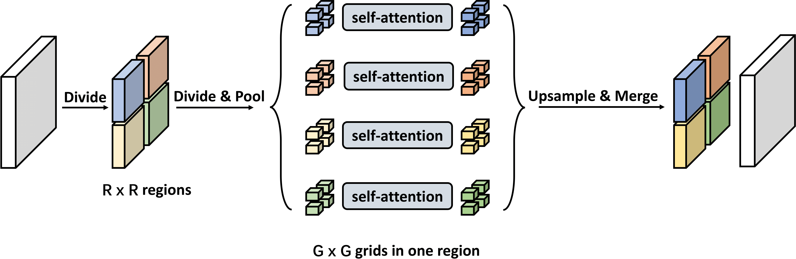
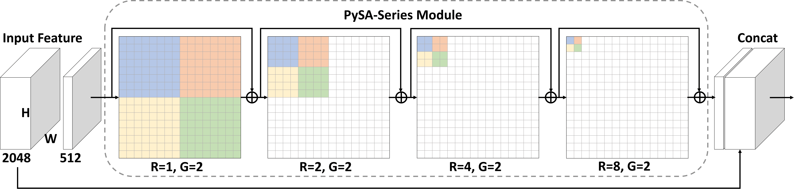
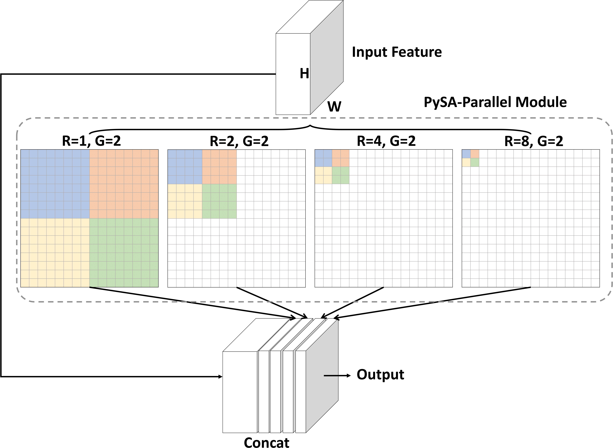

# Pyramid Self-Attention for Semantic Segmentation

Paper: Pyramid Self-Attention for Semantic Segmentation

by [Jiyang Qi](https://scholar.google.com/citations?user=v8pL6_gAAAAJ)1, [Xinggang Wang](https://xinggangw.info/)1,2 *, [Yao Hu](https://scholar.google.com/citations?user=LIu7k7wAAAAJ&hl=zh-CN)3, [Xu Tang](https://scholar.google.com/citations?user=grP24aAAAAAJ&hl=zh-CN)3, [Wenyu Liu](http://eic.hust.edu.cn/professor/liuwenyu/)1

1 [School of EIC, HUST](http://eic.hust.edu.cn/English/Home.htm), 2 Hubei Key Laboratory of Smart Internet Technology, 3 [Alibaba Group](https://www.alibaba.com/)

(*) Corresponding Author

# Introduction

Self-attention is vital in computer vision since it is the building block of Transformer and can model long-range context for visual recognition. However, computing pairwise self-attention between all pixels for dense prediction tasks (e.g., semantic segmentation) costs high computation. In this work, we propose a novel pyramid self-attention (PySA) mechanism which can collect global context information far more efficiently. Concretely, the basic module of PySA first divides the whole image into R x R regions, and then further divides every region into G x G grids. One feature is extracted for each grid and then self-attention is applied to the grid features within the same region. PySA keeps increasing R (e.g., from 1 to 8) to harvest more local context information and propagate global context to local regions in a parallel/series manner. Since G can be kept as a small value, the computation complexity is low.

# Architecture

 

 Overview of the proposed PySA-Series.

 

Overview of the proposed PySA-Parallel.

By keeping increasing R (e.g., from 1 to 8), models can harvest more local context information and propagate global context to local regions in a parallel/series manner.
